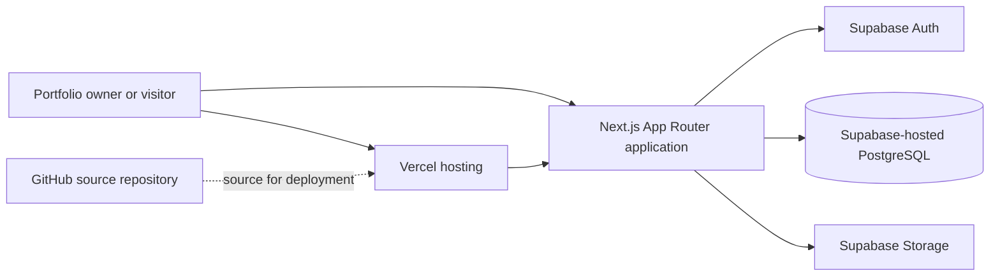

# EverLeaf — Online Portfolio Template Generator

## 1. Project introduction

EverLeaf is a web application for creating and sharing online portfolios. It brings profile information, education, skills, projects, work experience, contact details, and social links into one saved portfolio. Owners can select a visual design, preview their work, and choose whether to publish it.

The active web application is the Next.js project in `next-app/`. Laravel and Blade files remain at the repository root as an earlier implementation and design reference. The current documentation does not establish that the Laravel application is deployed.

## 2. Objectives

- Give users one place to create and maintain portfolio information.
- Save portfolio records and images through the configured Supabase services.
- Offer three distinct designs: Simple, Modern, and Creative.
- Support preview, editing, publishing, privacy, and recovery workflows.
- Provide a responsive experience for desktop and mobile screens.

## 3. Requirements and feature status

The table reflects source inspection. “In source” means relevant routes/components/actions were found; it does not certify successful live-service behavior. The project owner has separately reported testing CRUD operations against the online PostgreSQL database, which this audit did not independently repeat.

| Requirement | Source status | Notes |
| --- | --- | --- |
| Registration and login | In source | Supabase Auth flows are present. Hosted email configuration and end-to-end behavior were not independently checked. |
| Portfolio information form | In source | Create and edit routes collect profile and portfolio details. |
| Profile picture and project images | In source | Upload UI and Supabase Storage helper are present; hosted bucket configuration was not inspected. |
| Education and work experience | In source | Dedicated related tables and form controls are present. |
| Skills and projects | In source | Saved as JSONB fields on the portfolio record. |
| Contact details and social links | In source | Contact fields and social-link records are present. |
| Save and edit portfolio | In source | Server actions and authenticated dashboard routes are present. |
| Delete, restore, and permanent delete | In source | Soft deletion and recovery paths are present. |
| Simple, Modern, Creative templates | In source | Three separate template components are selected using `template_key`. |
| Preview and choose template | In source | Template preview and selection routes/components are present. |
| Publish and view public page | In source | Public rendering uses `/p/{slug}`; remote deployment behavior was not checked. |
| Private/public access controls | In source | Application state and migration RLS policies cover published access; live RLS state is unverified. |
| Responsive layout and theme | In source | Responsive styles and theme controls exist; this documentation task did not perform viewport/browser QA. |
| Logout and session handling | In source | Supabase SSR clients and proxy session refresh are present. |

## 4. Main workflows

### Portfolio owner

1. Register or sign in.
2. Create a portfolio and enter profile, education, skills, projects, experience, and contact information.
3. Optionally upload a profile image and project images.
4. Save the portfolio, select one of the three templates, and preview it.
5. Edit details or design as needed.
6. Publish to make the portfolio available at its public slug, or keep it private.
7. Manage, recover, or permanently delete portfolios from the account area.

### Visitor

1. Open a published portfolio URL.
2. View its content rendered with the saved template.
3. Follow the owner's contact or social links when supplied.

## 5. Architecture



The diagram describes the architecture represented by the source and the provided hosting URL. The current Vercel dashboard settings and live service connections were not inspected as part of this documentation update.

## 6. Application structure

- `next-app/src/app/`: Next.js App Router pages, route handlers/actions, and layouts.
- `next-app/src/components/`: reusable UI and portfolio template components.
- `next-app/src/lib/`: Supabase clients, authentication/session helpers, validation, and application utilities.
- `next-app/supabase/migrations/`: versioned PostgreSQL schema, Row Level Security, and Storage policy SQL.
- `resources/views/` and root `public/`: earlier Laravel/Blade implementation and its assets.
- `documentation/`: project documents and existing screenshots.

## 7. Portfolio designs

| Display name | Database key | Purpose |
| --- | --- | --- |
| Simple | `minimal` | Restrained editorial page for clear, professional reading. |
| Modern | `modern` | Dark sidebar and modular information cards. |
| Creative | `creative` | Framed, expressive grid with a distinct composition. |

The active Next.js source contains separate components and maps the saved key to the corresponding public rendering. The design descriptions are summaries rather than a substitute for viewing each page.

## 8. Database design

The committed migrations describe these tables:

| Table | Purpose | Relationship |
| --- | --- | --- |
| `portfolios` | Owner, slug, contact/profile details, template key, skills/projects JSONB, publish and soft-delete state. | References `auth.users`; parent for the detail tables. |
| `portfolio_education` | Education entries and ordering. | Many entries can belong to one portfolio. |
| `portfolio_experiences` | Work-experience entries and ordering. | Many entries can belong to one portfolio. |
| `portfolio_social_links` | Social platform labels, URLs, and ordering. | Many entries can belong to one portfolio. |

Migrations include foreign keys, indexes, constraints, and Row Level Security policies. The SQL files are repository evidence only; whether each migration and policy is applied to the remote Supabase project is **not verified**. Do not reapply migrations to production without reviewing current database state and following the project owner's deployment procedure.

### Image storage

The migrations configure a `portfolio-media` bucket and private access in later migration files. The source includes an upload helper that restricts images to PNG, JPEG, or WebP and a maximum of 50 MB, and a server helper that creates signed URLs with a 600-second lifetime. The actual remote bucket configuration and policies were not inspected.

## 9. Authentication and security

Source code uses Supabase Auth with server/browser clients from `@supabase/ssr` and `@supabase/supabase-js`. The route structure includes sign-up, sign-in, email callback, password recovery, password reset, and sign-out/session-related behavior. A Next.js proxy helper refreshes sessions using Supabase claims. Database migrations scope owner operations with RLS and permit reads of active published portfolios.

These are implementation findings, not a penetration test. Production secrets, email provider settings, redirect allowlists, remote RLS policies, and bucket policies were not inspected. Keep service-role credentials server-only and never commit `.env` files.

## 10. Configuration and deployment

The app's `env.example` lists these variable names:

| Variable | Purpose | Required according to source |
| --- | --- | --- |
| `NEXT_PUBLIC_SUPABASE_URL` | Supabase project URL. | Yes |
| `NEXT_PUBLIC_SUPABASE_PUBLISHABLE_KEY` | Browser-safe Supabase publishable key. | Yes |
| `NEXT_PUBLIC_SUPABASE_MEDIA_BUCKET` | Storage bucket name; source defaults to `portfolio-media`. | Optional if default is correct |
| `NEXT_PUBLIC_SITE_URL` | Site origin used for callbacks/links; local example is `http://localhost:3000`. | Has a local example; production callback behavior depends on correct value/configuration |

The active app root is `next-app/`; configure that as the Vercel Root Directory for the monorepo if not already set. Add environment variables to the relevant Vercel environment scopes. This report does not verify Vercel dashboard configuration or a fresh production deployment.

## 11. Local development and commands

```powershell
cd next-app
npm ci
Copy-Item env.example .env.local
# Add your own Supabase values to .env.local, then:
npm run dev
```

Available project scripts:

```powershell
npm run check
npm run build
npm run start
```

`check` runs the TypeScript compiler with no output. `build` creates a production build. `start` serves that build. The app has no dedicated test or lint script in its package configuration.

## 12. Testing and known limits

The result of checks run for this documentation update is recorded in [EverLeaf Testing Report](EverLeaf-Testing-Report.md). The root Laravel tests are separate from the active Next.js app. Source inspection and a successful build cannot prove hosted auth, database, image, browser, mobile, accessibility, or deployment behavior.

Items not independently verified in this audit:

- Remote Supabase migration/policy/bucket state and credentials.
- Live Vercel Root Directory, environment variables, deployment commit, and auto-deploy configuration.
- Browser-based visual behavior at desktop/mobile sizes and all account flows.
- Automated unit, integration, and end-to-end coverage for the Next.js app.
- Live availability of the provided website URL.

## 13. Conclusion

EverLeaf's active source is a Next.js application integrated with Supabase Auth, PostgreSQL, and Storage, with three template components and a Vercel deployment URL supplied by the project owner. Laravel/PHP remains in the repository as an earlier implementation. For a project presentation, distinguish verified repository code from remote settings and behavior that still need direct verification.
